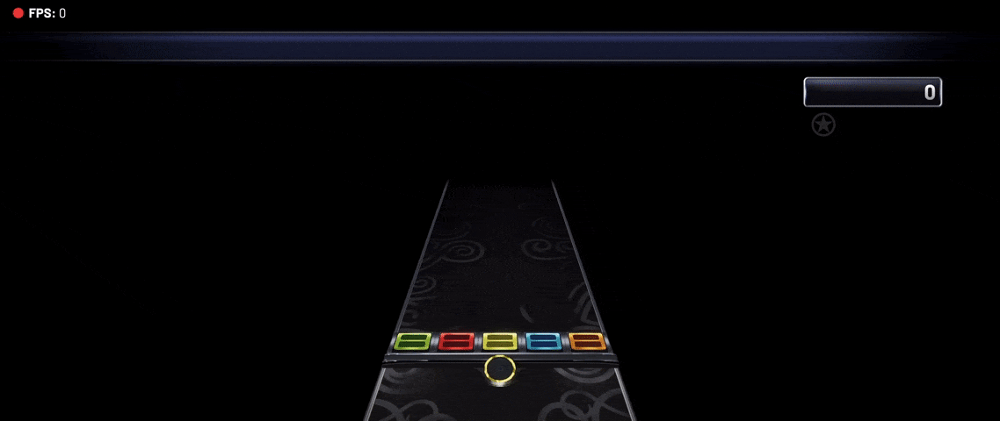

## 📺 **YAWO4YARG** - *Yet Another Widget Overlay for Yet Another Rhythm Game*

A Widget overlay compatible with [OBS](https://obsproject.com) (28.0.1 and newer) that shows the current song with album artwork and difficulty/source icon being played on [Yet Another Rhythm Game](https://github.com/YARC-Official/YARG).

---

---

# 📥 How to install

1. Download and extract this repository. You can do by [clicking here](https://github.com/Pantotone/YAWO4YARG/archive/refs/heads/main.zip).

2. Copy where the `currentSong.json` is stored.
    
    2.1. Open YARG

    2.2. Go to Settings

    2.3. In File Managment Section, click `Copy Current Song JSON File Path`

3. On the extracted widget folder, go to `settings` folder, open `CurrentSongFilePath.txt` with a text or code editor, paste inside and save it.

4. Create a new Browser Source on your OBS.

    - On the browser settings, mark "Local file", and locate the extracted widget folder and select `YARG Widget.html`
    - Set the width as `1920` and height as `260`. If it's too big, you can resize the widget on your canvas after you add it.

---

# ⚙️ List of settings

- [`DisplaySmallIcon.txt` - Change small icon beside the rim.](#displaysmallicontxt---change-small-icon-beside-the-rim)
- [`Instrument.txt` - Change current instrument.](#instrumenttxt---change-current-instrument)
- [`TextAlignment.txt` - Change text position.](#textalignmenttxt---change-text-position)
- [`LastFmAPIKey.txt` - Use Last.fm as a fallback when album art isn't available on chart.](#lastfmapikeytxt---use-lastfm-as-a-fallback-when-album-art-isnt-available-on-chart)

### `DisplaySmallIcon.txt` - Change small icon beside the rim.

1. On the extracted widget folder, go to `settings` folder, and open `DisplaySmallIcon.txt` with a text or code editor.

2. Place what you want to display on the small icon and save it.

> **Available icons: (not case-sensitive)**
>
> `instrument` (default) - will show the instrument being played along with the difficulty ring.
>
> `source` - will show the icon for the chart source. *(grabbed from [YARC-Official/OpenSource](https://github.com/YARC-Official/OpenSource))*
>
> `none` - will not show anything on the small icon.

### `Instrument.txt` - Change current instrument.

As for now, the widget isn't able to detect what instrument is being played. In case you're playing an instrument that's not Guitar, you might need to change inside the settings.

1. On the extracted widget folder, go to `settings` folder, and open `Instrument.txt` with a text or code editor.

2. Place what instrument you'll be playing

> **Warning** 
> This is case-sensitive.

> **Available instruments:**
>
> `GUITAR` - `GUITAR_COOP` - `REAL_GUITAR` - `RHYTHM` - `BASS` - `REAL_BASS` - `DRUMS` - `GH_DRUMS` - `REALDRUMS` - `KEYS` - `REAL_KEYS` - `VOCALS` - `HARMONY`

- You can put multiple instruments separated by a comma (example: `GUITAR,GUITAR_COOP,RHYTHM,BASS,KEYS`) so you don't have to change mid-screen in case a chart doesn't have specified instrument.
- The order you put the instruments will matter, as the widget will fetch the first instrument with chart available.
- In case you want to change the instrument mid-stream, just change the `Instrument.txt` and click `Refresh` on the Browser Source in OBS. (you can use Streamer.bot + StreamDeck to [write the file](https://wiki.streamer.bot/en/Sub-Actions/File/Write-To-File) + [refresh the browser source](https://wiki.streamer.bot/en/Broadcasters/OBS/Requests/Additional-Request-Info/RefreshBrowserSource))

### `TextAlignment.txt` - Change text position.

1. On the extracted widget folder, go to `settings` folder, and open `TextAligment.txt` with a text or code editor.

2. Place the alignment value and save.

> **Available alignment values: (not case-sensitive)**
>
> `left` (default) - Shows album art and text left-to-right
>
> `right` - Shows album art and text right-to-left
>
> `center` - Shows album art and text left-to-right, but widget will be centered on canvas

### `LastFmAPIKey.txt` - Use Last.fm as a fallback when album art isn't available on chart.

1. Go to [https://www.last.fm/api/account/create](https://www.last.fm/api/account/create) (you'll need to create an Last.fm account if you don't have)

2. You'll need to provide an `Application Name`, feel free to chose whatever name. (the other fields aren't required)

3. Copy your API key, you'll need it later.

4. On the extracted widget folder, go to `settings` folder, and open `LastFmAPIKey.txt` with a text or code editor.

5. Paste your API key, and save.
